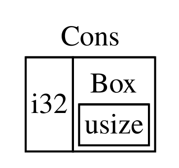

## Using `Box<T>` to Point to Data on the Heap

સૌથી સરળ સ્માર્ટ પોઇન્ટર એ બોક્સ છે, જેનો પ્રકાર `Box<T>` તરીકે લખવામાં આવે છે. બોક્સ તમને સ્ટેકને બદલે હીપ પર ડેટા સંગ્રહ કરવાની મંજૂરી આપે છે. સ્ટેક પર માત્ર હીપ ડેટા તરફ નિર્દેશ કરતો પોઇન્ટર રહે છે. સ્ટેક અને હીપ વચ્ચેનો તફાવત સમીક્ષા કરવા માટે પ્રકરણ 4 નો સંદર્ભ લો.

બોક્સમાં હીપ પર તેમના ડેટાને સંગ્રહિત કરવા સિવાય કોઈ વિશેષ કામગીરી ખર્ચ નથી. પરંતુ તેમની પાસે ઘણા વધારાના કાર્યો પણ નથી. તમે તેનો ઉપયોગ મોટાભાગે આ પરિસ્થિતિઓમાં કરશો:

જ્યારે તમારી પાસે એવો પ્રકાર હોય જેનો કદ સંકલન સમયે જાણી શકાતું નથી, અને તમે તે પ્રકારના મૂલ્યનો ઉપયોગ એવી પરિસ્થિતિમાં કરવા માંગો છો કે જેને ચોક્કસ કદની જરૂર હોય છે. જ્યારે તમારી

પાસે ડેટાની મોટી માત્રા હોય, અને તમે માલિકી સ્થાનાંતરિત કરવા માંગો છો પરંતુ ખાતરી કરવા માંગો છો કે ડેટા નકલ કરવામાં આવશે નહીં જ્યારે તમે આમ કરો છો.

જ્યારે તમે કોઈ મૂલ્યનો હકદારો બનવા માંગો છો, અને તમને માત્ર એટલું જ મહત્વ હોય છે કે તે કોઈ ચોક્કસ પ્રકારને બદલે કોઈ વિશેષ લક્ષણ (trait) લાગુ કરે છે.

અમે પ્રથમ પરિસ્થિતિ "Enabling Recursive Types with Boxes" માં દર્શાવીશું. બીજા કિસ્સામાં, મોટા પ્રમાણમાં ડેટાની માલિકી સ્થાનાંતરિત કરવી ઘણો સમય લઈ શકે છે કારણ કે ડેટાને સ્ટેક પર નકલ કરવામાં આવે છે. આ પરિસ્થિતિમાં કાર્યક્ષમતા સુધારવા માટે, અમે મોટા પ્રમાણના ડેટાને બોક્સમાં હીપ પર સંગ્રહ કરી શકીએ છીએ. પછી, માત્ર નાની રકમનો પોઇન્ટર ડેટા સ્ટેક પર નકલ કરવામાં આવે છે, જ્યારે તે નિર્દેશ કરેલો ડેટા હીપ પર એક જ જગ્યાએ રહે છે. ત્રીજો કિસ્સો ટ્રેઈટ ઓબ્જેક્ટ તરીકે ઓળખાય છે, અને પ્રકરણ 18 માં "Using Trait Objects to Abstract over Shared Behavior" એ વિષયને સમર્પિત છે. તેથી, અહીં તમે જે શીખો છો તે તમે તે વિભાગમાં ફરીથી લાગુ કરશો!

<!-- Old headings. Do not remove or links may break. -->
### Storing Data on the Heap

અમે `Box<T>` માટે કૂળ સંગ્રહણના ઉપયોગની ચર્ચા કરીએ તે પહેલાં, અમે વાક્યરચના અને `Box<T>` ની અંદર સંગ્રહિત મૂલ્યો સાથે કેવી રીતે ક્રિયાપ્રતિક્રિયા કરવી તે આવરી લઈશું.

પૃષ્ઠ 15-1 દર્શાવે છે કે કૂળનો ઉપયોગ કરીને `i32` મૂલ્યને કૂળ પર કેવી રીતે સંગ્રહિત કરવું.

<Listing number="15-1" file-name="src/main.rs" caption="Storing an `i32` value on the heap using a box">
```rust
{{#rustdoc_include ../listings/ch15-smart-pointers/listing-15-01/src/main.rs}}
```
</Listing>
અમે variable `b` ને એવી `Box` નું મૂલ્ય આપીએ છીએ જે `5` ની કિંમત તરફ નિર્દેશ કરે છે, જે હિપ પર ફાળવેલ છે. આ કાર્યક્રમ `b = 5` છાપશે; આ સ્થિતિમાં, અમે બોક્સમાં રહેલા ડેટાને એ જ રીતે મેળવી શકીએ છીએ જે રીતે જો તે ડેટા સ્ટેક પર હોત. કોઈપણ માલિકીવાળા મૂલ્યની જેમ, જ્યારે એક બોક્સ અવકાશમાંથી બહાર જાય છે, જેમ કે `b` `main` ના અંતે થાય છે, ત્યારે તે દૂર કરવામાં આવશે. આ દૂર કરવાની ક્રિયા બોક્સ (સ્ટેક પર સંગ્રહિત) અને તે જે ડેટા તરફ નિર્દેશ કરે છે (હિપ પર સંગ્રહિત) બંને માટે થાય છે.

એક મૂલ્યને હીપ પર મૂકવું બહુ ઉપયોગી નથી, તેથી તમે બોક્સને જાતે જ આ રીતે વાપરતા નહીં. `i32` જેવા મૂલ્યોને સ્ટેક પર રાખવા વધુ યોગ્ય છે, જ્યાં તેઓ મૂળભૂત રીતે સંગ્રહિત થાય છે, મોટાભાગની પરિસ્થિતિઓમાં. ચાલો એક એવા કિસ્સાને જોઈએ જ્યાં બોક્સ આપણને એવા પ્રકારો વ્યાખ્યાયિત કરવાની મંજૂરી આપે છે જે નહિંતર વ્યાખ્યાયિત કરવાની મંજૂરી ન મળતી.

### Enabling Recursive Types with Boxes

એક પુનરાવર્તિત પ્રકાર (recursive type) નું મૂલ્ય પોતાની અંદર એ જ પ્રકારના અન્ય મૂલ્યને સમાવી શકે છે. પુનરાવર્તિત પ્રકારો સમસ્યા ઊભી કરે છે કારણ કે Rust ને કમ્પાઇલ સમયે પ્રકાર દ્વારા કેટલી જગ્યા રોકાઈ છે તે જાણવાની જરૂર પડે છે. જોકે, પુનરાવર્તિત પ્રકારોનાં મૂલ્યોની ઘૂસણખોરી સૈદ્ધાંતિક રીતે અનંત સુધી ચાલુ રહી શકે છે, તેથી Rust એ જાણી શકતું નથી કે મૂલ્ય માટે કેટલી જગ્યા જોઈએ છે. કારણ કે બોક્સનું કદ નિશ્ચિત હોય છે, અમે પુનરાવર્તિત પ્રકાર વ્યાખ્યામાં બોક્સ દાખલ કરીને પુનરાવર્તિત પ્રકારોને સક્ષમ કરી શકીએ છીએ.

એક પુનરાવર્તિત પ્રકાર (recursive type)નું ઉદાહરણ તરીકે, ચાલો 'કોન્સ' યાદી (cons list) જોઈએ. આ એક એવો માહિતી પ્રકાર છે જે સામાન્ય રીતે કાર્યાત્મક પ્રોગ્રામિંગ ભાષાઓમાં જોવા મળે છે. આપણે જે કોન્સ યાદી પ્રકાર વ્યાખ્યાયિત કરીશું તે સીધો-સાદો હશે સિવાય કે પુનરાવર્તન; તેથી, આપણે જે ઉદાહરણ પર કામ કરીશું તેમાંની વિભાવનાઓ તમને કોઈપણ જટિલ પરિસ્થિતિઓમાં ઉપયોગી થશે જેમાં પુનરાવર્તિત પ્રકારો સામેલ હોય.

<!-- Old headings. Do not remove or links may break. -->
#### Understanding the Cons List

કન્સ યાદી એ એક માહિતી રચના છે જે લિસ્પ પ્રોગ્રામિંગ ભાષા અને તેના પ્રકારોમાંથી આવે છે, તે સંવૃત જોડીઓથી બનેલી હોય છે, અને તે લિસ્પનું સાંકળિત યાદીનું સ્વરૂપ છે. તેનું નામ લિસ્પમાં `cons` વિધેયાક (construct વિધેયાક માટે ટૂંકું) પરથી આવ્યું છે જે બે Argumentોમાંથી નવી જોડી બનાવે છે. `cons` ને મૂલ્ય અને બીજી જોડી ધરાવતી જોડી પર બોલાવીને, આપણે પુનરાવર્તિત જોડીઓથી બનેલી કન્સ યાદીઓનું નિર્માણ કરી શકીએ છીએ.

અહીં એક ગૌણ કોડ ઉદાહરણ છે જે કન્સ યાદીનું પ્રતિનિધિત્વ કરે છે જેમાં `1, 2, 3` યાદી દરેક જોડીને કૌંસમાં દર્શાવેલ છે:

```text
(1, (2, (3, Nil)))
```
દરેક વસ્તુમાં એક મૂલ્ય અને પછીની વસ્તુ હોય છે. યાદીનો અંતિમ વસ્તુ માત્ર એક મૂલ્ય ધરાવે છે જેને `Nil` કહેવાય છે, જેમાં કોઈ પછીની વસ્તુ નથી. `cons` વિધેયને પુનરાવર્તિત રીતે બોલાવીને એક યાદી બનાવવામાં આવે છે. આ પુનરાવૃત્તિના આધાર કેસને દર્શાવવા માટે પ્રમાણભૂત નામ `Nil` છે. નોંધ કરો કે આ "null" અથવા "nil" ખ્યાલથી અલગ છે જે પ્રકરણ ૬ માં ચર્ચા કરવામાં આવ્યો હતો, જે એક અમાન્ય અથવા ગેરહાજર મૂલ્ય છે.

The cons યાદી સામાન્ય રીતે Rust માં વપરાતો ડેટા સ્ટ્રક્ચર નથી. મોટાભાગના સમયમાં જ્યારે તમારી પાસે Rust માં વસ્તુઓની યાદી હોય છે, ત્યારે `Vec<T>` વાપરવાનું વધુ સારું પસંદગી છે. અન્ય, વધુ જટિલ રિકર્સિવ ડેટા પ્રકારો વિવિધ પરિસ્થિતિઓમાં ઉપયોગી છે, પરંતુ આ પ્રકરણમાં cons યાદીથી શરૂ કરીને, અમે એ શોધ કરી શકીએ છીએ કે બોક્સ કેવી રીતે આપણને એક રિકર્સિવ ડેટા પ્રકાર વ્યાખ્યાયિત કરવા દે છે જેમાં બહુ ઓછો વિક્ષેપ પડે છે.

ચિઠ્ઠી 15-2 માં cons યાદી માટે એક enum વ્યાખ્યા છે. નોંધ કરો કે આ કોડ હજી કમ્પાઇલ થશે નહીં, કારણ કે `List` પ્રકારનું જાણીતું કદ નથી, જે આપણે દર્શાવીશું.

<Listing number="15-2" file-name="src/main.rs" caption="The first attempt at defining an enum to represent a cons list data structure of `i32` values">
```rust
{{#rustdoc_include ../listings/ch15-smart-pointers/listing-15-02/src/main.rs:here}}
```
</Listing>
નોંધ: આ ઉદાહરણ માટે, અમે માત્ર `i32` મૂલ્યો ધરાવતી એક કન્સ યાદી અમલમાં મૂકી રહ્યા છીએ. આપણે પ્રકરણ ૧૦ માં ચર્ચા કરી હતી તેમ, સામાન્ય પ્રકારોનો ઉપયોગ કરીને પણ તેને અમલમાં મૂકી શક્યા હોત, જેથી કોઈપણ પ્રકારના મૂલ્યો સંગ્રહિત કરી શકે તેવી કન્સ યાદી પ્રકાર વ્યાખ્યાયિત કરી શક્યા હોત.

`List` પ્રકારનો ઉપયોગ કરીને `1, 2, 3` યાદી સંગ્રહિત કરવાની રીત યાદી ૧૫-૩ માં દર્શાવેલ કોડ જેવી દેખાશે.

<Listing number="15-3" file-name="src/main.rs" caption="Using the `List` enum to store the list `1, 2, 3`">
```rust
{{#rustdoc_include ../listings/ch15-smart-pointers/listing-15-03/src/main.rs:here}}
```
</Listing>
The first `Cons` મૂલ્ય ધારણ કરે છે `1` અને અન્ય એક `List` મૂલ્ય. આ `List` મૂલ્ય બીજું એક `Cons` મૂલ્ય છે જે `2` અને અન્ય એક `List` મૂલ્ય ધારણ કરે છે. આ `List` મૂલ્ય વધુ એક `Cons` મૂલ્ય છે જે `3` અને એક `List` મૂલ્ય ધારણ કરે છે, જે અંતે `Nil` છે - એવાં બિન-પુનરાવર્તિત સ્વરૂપ જે યાદીના અંતને સૂચવે છે.

જો આપણે Listing 15-3 માં આપેલ કોડને કમ્પાઇલ કરવાનો પ્રયત્ન કરીએ, તો આપણને Listing 15-4 માં દર્શાવેલ ભૂલ મળે છે.

<Listing number="15-4" caption="The error we get when attempting to define a recursive enum">
```console
{{#include ../listings/ch15-smart-pointers/listing-15-03/output.txt}}
```
</Listing>
ભૂલ દર્શાવે છે કે આ પ્રકાર "અનંત કદ ધરાવે છે". તેનું કારણ એ છે કે આપણે `List` ને એક એવી વિવિધતા (variant) સાથે વ્યાખ્યાયિત કર્યું છે જે પુનરાવર્તક (recursive) છે: તે પોતાની જાતનું બીજું મૂલ્ય સીધું જ સમાવે છે. પરિણામે, Rust એ નક્કી કરી શકતું નથી કે `List` મૂલ્ય સંગ્રહ કરવા માટે તેને કેટલી જગ્યાની જરૂર છે. ચાલો જોઈએ કે આ ભૂલ શા માટે આવે છે. સૌ પ્રથમ, આપણે જોઈશું કે Rust એક બિન-પુનરાવર્તક (non-recursive) પ્રકારના મૂલ્યને સંગ્રહ કરવા માટે કેટલી જગ્યાની જરૂર છે તે કેવી રીતે નક્કી કરે છે.

#### Computing the Size of a Non-Recursive Type

યાદ કરો કે આપણે યાદી ૬-૨ માં, જ્યારે આપણે પ્રકરણ ૬ માં એનુમ વ્યાખ્યાઓ વિશે વાત કરી હતી, ત્યારે `Message` એનુમ વ્યાખ્યાયિત કર્યો હતો:

```rust
{{#rustdoc_include ../listings/ch06-enums-and-pattern-matching/listing-06-02/src/main.rs:here}}
```
เพื่อ નિર્ધારિત કરવું કે `Message` મૂલ્ય માટે કેટલી જગ્યા ફાળવવી, Rust દરેક પ્રકારની ભિન્નતા (variants) તપાસે છે કે કઈ ભિન્નતાને સૌથી વધુ જગ્યાની જરૂર છે. Rust જુએ છે કે `Message::Quit` ને કોઈ જગ્યાની જરૂર નથી, `Message::Move` ને બે `i32` મૂલ્યો સંગ્રહિત કરવા માટે પૂરતી જગ્યાની જરૂર છે, અને એ જ રીતે. કારણ કે માત્ર એક જ ભિન્નતાનો ઉપયોગ થશે, તેથી `Message` મૂલ્યને જરૂરી સૌથી વધુ જગ્યા તેની સૌથી મોટી ભિન્નતાને સંગ્રહિત કરવા

માટે લાગતી જગ્યા જેટલી જ હશે. આ બાબત સાથે સરખાવો કે જ્યારે Rust `List` enum જેવી પુનરાવર્તિત (recursive) પ્રકારની કેટલી જગ્યા નિર્ધારિત કરવાનો પ્રયાસ કરે છે, ત્યારે શું થાય છે, જે યાદી 15-2 માં દર્શાવેલ છે. કમ્પાઇલર `Cons` ભિન્નતાને જોઈને શરૂઆત કરે છે, જેમાં `i32` પ્રકારનું મૂલ્ય અને `List` પ્રકારનું મૂલ્ય હોય છે. તેથી, `Cons` ને `i32` ના કદ જેટલી જગ્યા અને `List` ના કદ જેટલી જગ્યાની જરૂર પડે છે. `List` પ્રકારને કેટલી મેમરીની જરૂર છે તે શોધવા માટે, કમ્પાઇલર ભિન્નતાઓને જુએ છે, જેમાં `Cons` ભિન્નતાનો સમાવેશ થાય છે. `Cons` ભિન્નતામાં `i32` પ્રકારનું મૂલ્ય અને `List` પ્રકારનું મૂલ્ય હોય છે, અને આ પ્રક્રિયા આકૃતિ 15-1 માં દર્શાવ્યા પ્રમાણે અનંત ચાલુ રહે છે.


આકૃતિ ૧૫-૧: એક અનંત `List` જેમાં અનંત `Cons` પ્રકારો છે.

<!-- Old headings. Do not remove or links may break. -->
#### Getting a Recursive Type with a Known Size

કારણ કે Rust એ કેવી રીતે પરસ્પર વ્યાખ્યાયિત પ્રકારો માટે જગ્યા ફાળવવી તે નક્કી કરી શકતું નથી, ત્યારે compiler એક ભૂલ આપે છે જેમાં આ મદદરૂપ સૂચન હોય છે:

<!-- manual-regeneration
after doing automatic regeneration, look at listings/ch15-smart-pointers/listing-15-03/output.txt and copy the relevant line
-->
```text
help: insert some indirection (e.g., a `Box`, `Rc`, or `&`) to break the cycle
  |
2 |     Cons(i32, Box<List>),
  |               ++++    +
```
અહીં સૂચવેલ બાબતમાં, પરોક્ષતાનો અર્થ એ થાય છે કે મૂલ્યને સીધું સંગ્રહિત કરવાને બદલે, આપણે ડેટા માળખામાં ફેરફાર કરવો જોઈએ જેથી મૂલ્યને પરોક્ષ રીતે સંગ્રહિત કરવામાં આવે, એટલે કે મૂલ્ય તરફ નિર્દેશ કરનાર પોઇન્ટરને સંગ્રહિત કરીને.

કારણ કે `Box<T>` એક પોઇન્ટર છે, Rust ને હંમેશા ખબર હોય છે કે `Box<T>` ને કેટલી જગ્યાની જરૂર છે: પોઇન્ટરનું કદ તે જે ડેટા તરફ નિર્દેશ કરે છે તેની માત્રા પર આધારિત નથી રહેતું. આનો અર્થ એ થાય છે કે આપણે `Cons` પ્રકારમાં બીજા `List` મૂલ્યને બદલે `Box<T>` મૂકી શકીએ છીએ. `Box<T>` હીપ પરના આગામી `List` મૂલ્ય તરફ નિર્દેશ કરશે, જે `Cons` પ્રકારની અંદર નહીં હોય. ખ્યાલ તરીકે, આપણી પાસે હજી પણ એક યાદી છે, જે અન્ય યાદીઓ ધરાવતી યાદીઓથી બનેલી છે, પરંતુ આ અમલીકરણ હવે એકબીજાની અંદર મૂકવાને બદલે વસ્તુઓને એકબીજાની બાજુમાં મૂકવા જેવું લાગે છે.

આપણે યાદી ૧૫-૨ માં `List`  એનમની વ્યાખ્યા અને યાદી ૧૫-૩ માં `List` નો ઉપયોગને યાદી ૧૫-૫ ના કોડમાં બદલી શકીએ છીએ, જે કમ્પાઇલ થશે.

<Listing number="15-5" file-name="src/main.rs" caption="The definition of `List` that uses `Box<T>` in order to have a known size">
```rust
{{#rustdoc_include ../listings/ch15-smart-pointers/listing-15-05/src/main.rs}}
```
</Listing>
`Cons` પ્રકારને `i32` ના કદની જરૂર પડે છે, સાથે બોક્સના પોઇન્ટર ડેટા માટે જગ્યા પણ જોઈએ છે. `Nil` પ્રકાર કોઈ મૂલ્યો સંગ્રહિત કરતું નથી, તેથી તે `Cons` પ્રકાર કરતાં સ્ટેક પર ઓછી જગ્યા લે છે. હવે આપણે જાણીએ છીએ કે કોઈપણ `List` મૂલ્ય `i32` ના કદ જેટલું હશે, સાથે બોક્સના પોઇન્ટર ડેટાના કદ પ્રમાણે પણ જગ્યા લેશે. બોક્સનો ઉપયોગ કરીને, આપણે અનંત, પુનરાવર્તિત શૃંખલા તોડીએ છીએ, જેથી કમ્પાઇલરને ખબર પડે છે કે `List` મૂલ્ય સંગ્રહ કરવા માટે તેને કેટલી જગ્યાની જરૂર છે. આકૃતિ 15-2 દર્શાવે છે કે હવે `Cons` પ્રકાર કેવો દેખાય છે.


Figure 15-2: એક `List` જે અનંત કદનું નથી, કારણ કે `Cons` માં એક `Box` છે.

બોક્સ માત્ર પરોક્ષતા અને હીપ ફાળવણી પૂરી પાડે છે; તેમની પાસે અન્ય કોઈ વિશેષ ક્ષમતાઓ નથી, જે આપણે અન્ય સ્માર્ટ પોઇન્ટર પ્રકારો સાથે જોઈશું. તેમની પાસે આ વિશેષ ક્ષમતાઓને કારણે થતો પ્રદર્શન બોજ પણ નથી, તેથી તે એવા કિસ્સાઓમાં ઉપયોગી થઈ શકે છે જ્યાં માત્ર પરોક્ષતા જ એકમાત્ર લક્ષણ છે જેની આપણને જરૂર છે. આપણે પ્રકરણ 18 માં બોક્સ માટે વધુ ઉપયોગના કિસ્સાઓ જોઈશું.

`Box<T>` પ્રકાર એક સ્માર્ટ પોઇન્ટર છે કારણ કે તે `Deref` લક્ષણ (trait) અમલમાં મૂકે છે, જે `Box<T>` મૂલ્યોને સંદર્ભોની જેમ ગણવામાં આવે તે માટે પરવાનગી આપે છે. જ્યારે કોઈ `Box<T>` મૂલ્ય અવકાશમાંથી બહાર જાય છે, ત્યારે બોક્સ દ્વારા નિર્દેશિત ઢગલા (heap) નો ડેટા પણ સાફ થઈ જાય છે કારણ કે `Drop` લક્ષણનો અમલ થયેલો હોય છે. આ બે લક્ષણો અન્ય સ્માર્ટ પોઇન્ટર પ્રકારો દ્વારા પૂરી પાડવામાં આવતી કાર્યક્ષમતા માટે વધુ મહત્વપૂર્ણ રહેશે. ચાલો આ બે લક્ષણોને વધુ વિગતવાર જોઈએ.


[trait-objects]: ch18-02-trait-objects.html#using-trait-objects-to-abstract-over-shared-behavior
